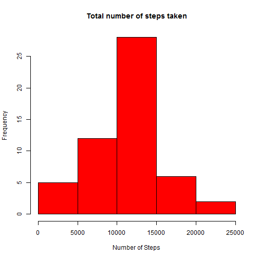
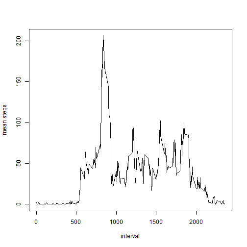
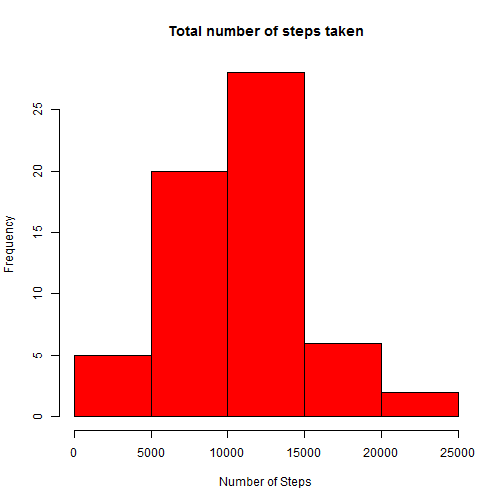
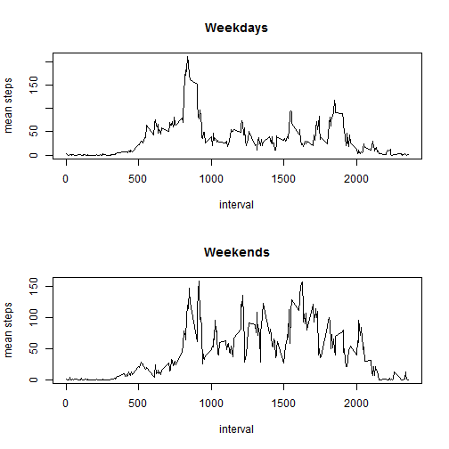

## Loading and preprocessing the data


```r
rawData <- read.csv("activity.csv")
rawData$date <- as.Date(rawData$date, "%Y-%m-%d")
totalSteps <- aggregate(steps ~ date, data = rawData, sum, na.rm = TRUE)
head(rawData)
```

```
##   steps       date interval
## 1    NA 2012-10-01        0
## 2    NA 2012-10-01        5
## 3    NA 2012-10-01       10
## 4    NA 2012-10-01       15
## 5    NA 2012-10-01       20
## 6    NA 2012-10-01       25
```

histogram of total number of steps taken each day:


```r
hist(totalSteps$steps, main="Total number of steps taken", ylab="Frequency", xlab="Number of Steps", col="red")
```

 

## What is mean total number of steps taken per day?


```r
mean(totalSteps$steps, na.rm = T)
```

```
## [1] 10766.19
```

```r
median(totalSteps$steps, na.rm = T)
```

```
## [1] 10765
```

## What is the average daily activity pattern?


```r
intervalSteps <- aggregate(steps ~ interval, data = rawData, mean, na.rm = TRUE)
plot(intervalSteps$interval, intervalSteps$steps, type="l", ylab ="mean steps", xlab = "interval")
```

 

total number of missing data

```r
sum(as.numeric(is.na(rawData$steps)))
```

```
## [1] 2304
```

## Imputing missing values

Strategy:

Replace each NA with the mean for the corresponding 5-minute interval. 


```r
newData <- rawData
for (i in 1:nrow(rawData) )
{
  if ( is.na(rawData[i,1]) ) {
    interval <- rawData[i,3]
    correspondingRow <- interval / 5 + 1
    newData[i,1] <- intervalSteps[correspondingRow,2]
  }
}
```

Histogram of the total number of steps after data is filled in:


```r
newTotalSteps <- aggregate(steps ~ date, data = newData, sum, na.rm = TRUE)
hist(newTotalSteps$steps, main="Total number of steps taken", ylab="Frequency", xlab="Number of Steps", col="red")
```

 

```r
mean(newTotalSteps$steps, na.rm = T)
```

```
## [1] 10282.14
```

```r
median(newTotalSteps$steps, na.rm = T)
```

```
## [1] 10395
```


## Are there differences in activity patterns between weekdays and weekends?


```r
newData$posixdate <- as.POSIXlt(newData$date)

#weekends
weekends <- newData[which(newData$posixdate$wday == 0 | newData$posixdate$wday == 6),]
intervalStepsWeekends <- aggregate(steps ~ interval, data = weekends, mean, na.rm = TRUE)

#weekdays
weekdays <- newData[which(newData$posixdate$wday > 0 & newData$posixdate$wday < 6),]
intervalStepsWeekdays <- aggregate(steps ~ interval, data = weekdays, mean, na.rm = TRUE)
```

Panel plot of average number of steps taken per 5-minute interval, colored by weekend/weekday:

```r
par(mfrow=c(2,1))
plot(intervalStepsWeekdays$interval, intervalStepsWeekdays$steps, type="l", main ="Weekdays", ylab ="mean steps", xlab = "interval")
plot(intervalStepsWeekends$interval, intervalStepsWeekends$steps, type="l", main ="Weekends", ylab ="mean steps", xlab = "interval")
```

 

